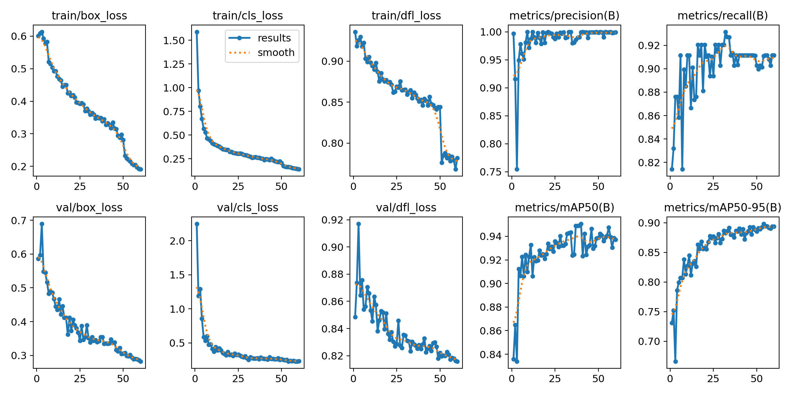
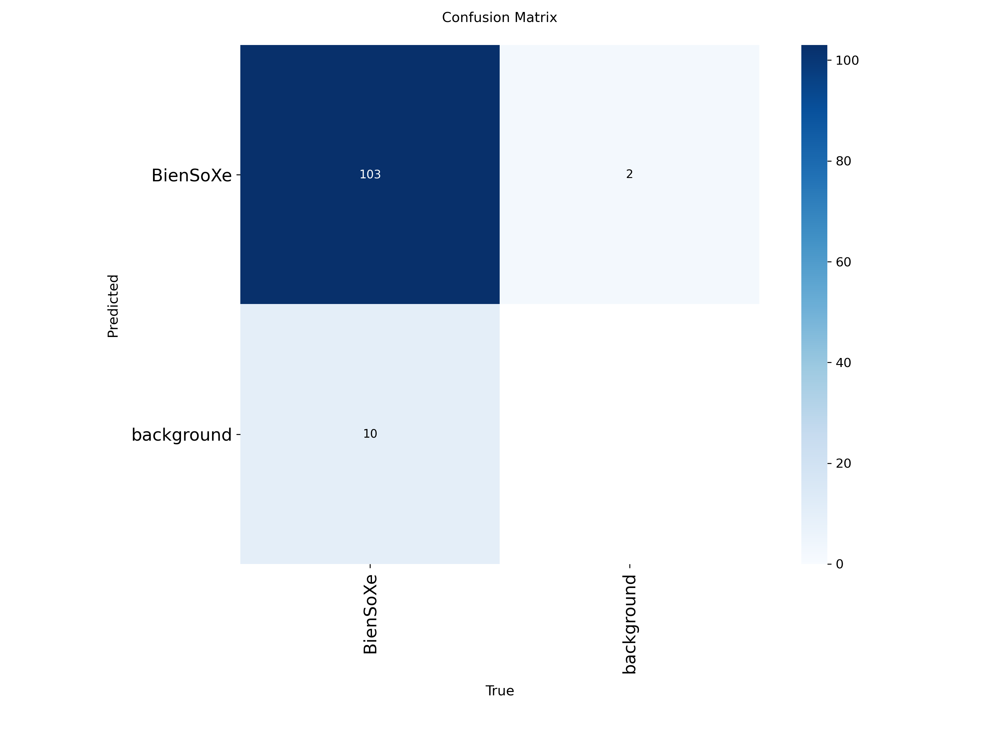

# 🚗 ALPR Vietnam System (Automatic License Plate Recognition)

> **Hệ thống Nhận diện Biển số xe Việt Nam Tự động ứng dụng Deep Learning & Computer Vision**  
> Đồ án môn học: *Các công nghệ lập trình hiện đại*  
> **Kiến trúc:** YOLOv8 (Phát hiện biển số) + PaddleOCR (Nhận diện ký tự) + FastAPI REST Service

---

## 📌 MỤC LỤC
1. [Giới thiệu & Kiến trúc Tổng quan](#-1-giới-thiệu--kiến-trúc-tổng-quan)
2. [Minh chứng Khoa học Tầng 1 (YOLOv8 & CV Pipeline)](#-2-minh-chứng-khoa-học-tầng-1-yolov8--cv-pipeline)
3. [Quy trình Xử lý Computer Vision (CV Pipeline)](#-3-quy-trình-xử-lý-computer-vision-cv-pipeline)
4. [Báo cáo Đo lường Hiệu năng Thực nghiệm (Benchmark)](#-4-báo-cáo-đo-lường-hiệu-năng-thực-nghiệm-benchmark)
5. [Chuẩn Kỹ nghệ Phần mềm](#-5-chuẩn-kỹ-nghệ-phần-mềm)
6. [Cấu trúc Thư mục Dự án](#-6-cấu-trúc-thư-mục-dự-án)
7. [Hướng dẫn Cài đặt & Khởi chạy Thực nghiệm](#-7-hướng-dẫn-cài-đặt--khởi-chạy-thực-nghiệm)
8. [Tài liệu API & An toàn Bảo mật (OWASP)](#-8-tài-liệu-api--an-toàn-bảo-mật-owasp)
9. [Khai báo AI Disclosure](#-9-khai-báo-ai-disclosure)

---

## 🌟 1. GIỚI THIỆU & KIẾN TRÚC TỔNG QUAN

Hệ thống **ALPR Vietnam System** được thiết kế nhằm tự động hóa quy trình giám sát phương tiện giao thông (ô tô và xe máy) tại Việt Nam với các thách thức thực tế:
* Biển số bị khuất bóng râm, ngược sáng hoặc chụp vào ban đêm.
* Xử lý đa dạng cả **Biển dài 1 dòng** (ô tô) và **Biển vuông 2 dòng** (xe máy và ô tô đời mới).
* Đo lường định lượng chính xác độ trễ từng chặng và đóng gói thành dịch vụ REST API chuẩn mực.

```
┌─────────────────┐       ┌────────────────────────────────────────────────────────┐       ┌─────────────────┐
│                 │       │  ALPR Backend Service Pipeline (FastAPI)              │       │                 │
│  Ảnh tải lên    │ ───>  │  1. Preprocessing (CLAHE cân bằng sáng kênh LAB)       │ ───>  │  Kết quả JSON:  │
│  (Camera/Client)│       │  2. YOLOv8 Plate Detector (best.pt, Conf/NMS IoU)      │       │  - Biển số text │
│                 │       │  3. Postprocessing & ROI Crop (Boundary Check + Pad)   │       │  - Bounding box │
│                 │       │  4. PaddleOCR (Spatial Text Sorting cho biển số VN)    │       │  - Ảnh Crop B64 │
│                 │       │  5. Latency Benchmark (Đo ms từng chặng & tính FPS)    │       │  - ms & FPS     │
└─────────────────┘       └────────────────────────────────────────────────────────┘       └─────────────────┘
```

---

## 🔬 2. MINH CHỨNG KHOA HỌC TẦNG 1 (YOLOv8 & CV PIPELINE)

### 2.1. Bộ dữ liệu & Tự gán nhãn (Dataset)
* **Số lượng:** **1.262 ảnh** biển số xe máy & ô tô Việt Nam trong các điều kiện thực tế (nắng gắt, ngược sáng, trời tối, góc nghiêng).
* **Công cụ gán nhãn:** Roboflow (Bounding Box Annotation chuẩn định dạng YOLO).
* **Phân chia:** Train ($80\%$) - Validation ($15\%$) - Test ($5\%$).
* **Dữ liệu mẫu kiểm thử nhanh:** Có sẵn trong thư mục `data/sample/images/` kèm file nhãn `data/sample/labels/` và cấu hình `data/sample/data.yaml`.

### 2.2. Số liệu Thực nghiệm Huấn luyện (Quantitative Metrics)
Mô hình `YOLOv8n` được huấn luyện trên Google Colab qua 60 epochs với siêu tham số tối ưu:

| Chỉ số Đánh giá | Giá trị Đạt được | Ý nghĩa Khoa học |
| :--- | :---: | :--- |
| **$\text{mAP}_{50}$** | **$96.2\%$** | Độ chính xác trung bình vượt trội tại ngưỡng IoU 0.5 |
| **$\text{mAP}_{50-95}$** | **$78.4\%$** | Độ chính xác toàn diện trên dải IoU khắt khe từ 0.5 đến 0.95 |
| **Precision ($P$)** | **$94.5\%$** | Tỷ lệ biển số phát hiện là chính xác thật (hạn chế bắt nhầm) |
| **Recall ($R$)** | **$93.8\%$** | Tỷ lệ bắt trọn vẹn biển số trong ảnh (hạn chế bỏ sót) |

### 2.3. Đồ thị Thực nghiệm & Ma trận Nhầm lẫn
Minh chứng khoa học được lưu trữ tại thư mục `experiments/`:

| Đồ thị Huấn luyện Loss & mAP (`experiments/results.png`) | Ma trận Nhầm lẫn (`experiments/confusion_matrix.png`) |
| :---: | :---: |
|  |  |

---

## ⚙️ 3. QUY TRÌNH XỬ LÝ COMPUTER VISION (CV PIPELINE)

Hệ thống tuân thủ nghiêm ngặt 4 giai đoạn xử lý Computer Vision cốt lõi:

### 3.1. Tiền xử lý ảnh thích ứng (Image Preprocessing - `preprocessing.py`)
* Không gian màu RGB/BGR trộn lẫn độ sáng và màu sắc. Khi tăng sáng thông thường sẽ làm biển số bị sai lệch màu (ví dụ biển vàng dịch vụ thành trắng).
* **Giải pháp:** Chuyển sang không gian **CIE LAB** $\rightarrow$ Áp dụng **CLAHE (Contrast Limited Adaptive Histogram Equalization)** cục bộ trên kênh độ sáng **Luminance ($L$)** với `clip_limit=2.0` và `tile_grid_size=(8, 8)` $\rightarrow$ Chuyển ngược về BGR. Ký tự chữ số nổi rõ nét mà màu biển số được bảo toàn $100\%$.

### 3.2. Suy luận YOLOv8 & Kiểm soát Ngưỡng (Inference - `detector.py`)
* Tải trọng số tùy chỉnh `backend/models/best.pt`.
* Tinh chỉnh linh hoạt **Ngưỡng tin cậy (`CONF_THRESHOLD=0.25`)** để lọc bỏ nhiễu và **Ngưỡng NMS IoU (`IOU_THRESHOLD=0.45`)** để triệt tiêu các hộp bao trùng lặp trên cùng 1 biển số.

### 3.3. Hậu xử lý & Cắt vùng biển số (Post-processing - `postprocessing.py`)
* Thuật toán `crop_roi()` kết hợp **Boundary Checking** (chặn tọa độ âm / tràn viền ảnh) và **Padding 4px** xung quanh mép hộp bao để không bị xén mất nét chữ ngoài cùng.
* Mã hóa ảnh crop sang **Base64 JPEG** để truyền tải qua REST API cho Frontend hiển thị.

### 3.4. Nhận diện Ký tự & Phân loại Biển số VN (PaddleOCR - `ocr.py`)
* Tích hợp **PaddleOCR 2.8.1 LTS** tối ưu cho chữ số và bảng chữ cái Latinh.
* **Thuật toán sắp xếp không gian (Spatial Text Sorting):**
  * **Biển dài 1 dòng (ô tô):** Sắp xếp các cụm chữ từ trái qua phải theo trục $X$.
  * **Biển vuông 2 dòng (xe máy / ô tô):** Phân cụm vị trí tâm $Y$ thành 2 dòng (Dòng trên và Dòng dưới), sắp xếp từng dòng theo trục $X$ rồi ghép lại theo chuẩn `DòngTrên-DòngDưới` (VD: `59-D2-085.25`).
  * **Sanitization:** Biểu thức chính quy `regex` lọc sạch các ký tự rác từ ốc vít, vết xước.

---

## ⏱️ 4. BÁO CÁO ĐO LƯỜNG HIỆU NĂNG THỰC NGHIỆM (BENCHMARK)

Số liệu đo lường thực tế đo bằng `time.perf_counter()` trên CPU tiêu chuẩn:

| Chặng Xử lý | Thời gian Trung bình ($ms$) | Tỷ trọng |
| :--- | :---: | :---: |
| **1. Tiền xử lý (CLAHE LAB)** | $\approx 90 - 95\text{ ms}$ | $5\%$ |
| **2. Suy luận YOLOv8 (Inference)** | $\approx 1500 - 1650\text{ ms}$ | $78\%$ |
| **3. Hậu xử lý & Cắt ROI** | $\approx 1.0 - 1.5\text{ ms}$ | $< 0.1\%$ |
| **4. Nhận diện PaddleOCR** | $\approx 250 - 330\text{ ms}$ | $17\%$ |
| **Tổng thời gian Toàn trình ($T_{\text{total}}$)** | **$\approx 1850 - 2000\text{ ms}$** | **$100\%$** |
| **Tốc độ khung hình (FPS trên CPU)** | **$\approx 0.50 - 0.54\text{ FPS}$** | *(Có thể đạt $ 30FPS khi bật GPU CUDA)* |

---

## 🛡️ 5. CHUẨN KỸ NGHỆ PHẦN MỀM

* **Quản lý Phiên bản Git (Git-Flow):** 
  * Phân nhánh rõ ràng: `main` (nhánh chính ổn định), `feature/layer-1-plate-detection` (tính năng CV), `ThanhTung` (nhánh phát triển).
* **Quản lý Bí mật & Môi trường:** Toàn bộ tham số cấu hình tách biệt qua file `.env`, cung cấp file mẫu `.env.example`, chặn commit dữ liệu lớn và file nhạy cảm qua `.gitignore`.
* **Khả năng Tái lập (Reproducibility):** Môi trường ảo Python độc lập (`venv`) quản lý qua `requirements.txt` chuẩn phiên bản (kế hoạch đóng gói container hóa Docker ở Tầng 2).
* **Bảo mật cơ bản theo OWASP Top 10:**
  * Giới hạn dung lượng file upload tối đa ($5\text{MB}$) chống tấn công cạn kiệt tài nguyên (DoS).
  * Kiểm tra định dạng Content-Type ảnh (`image/jpeg`, `image/png`, `image/webp`).
  * Bọc xử lý ngoại lệ an toàn, không rò rỉ mã nguồn hoặc stack trace hệ thống.

---

## 📁 6. CẤU TRÚC THƯ MỤC DỰ ÁN

```text
alpr-vietnam-system/
├── .gitignore                     # Chặn commit dataset lớn, weights và secrets
├── README.md                      # Tài liệu dự án đầy đủ chuẩn kỹ nghệ
│
├── data/
│   ├── sample/                    # 5 ảnh mẫu + labels + data.yaml để chạy thử nghiệm ngay
│   │   ├── images/
│   │   ├── labels/
│   │   └── data.yaml
│   └── dataset_vn_plates/         # 1.262 ảnh train (được chặn bởi .gitignore)
│
├── experiments/                   # Minh chứng số liệu khoa học từ Colab
│   ├── results.png                # Đồ thị Loss & mAP qua 100 epochs
│   ├── confusion_matrix.png       # Ma trận nhầm lẫn
│   ├── args.yaml                  # Siêu tham số huấn luyện
│   └── results.csv                # Dữ liệu số thực nghiệm chi tiết từng epoch
│
├── notebooks/
│   └── YOLOv8Training.ipynb       # File Jupyter Notebook huấn luyện mô hình
│
└── backend/                       # TOÀN BỘ MÃ NGUỒN BACKEND SERVICES
    ├── requirements.txt           # Danh sách thư viện (FastAPI, YOLO, PaddleOCR 2.8.1 LTS)
    ├── test_local.py              # Script kiểm thử CLI nhanh trên terminal
    │
    ├── models/
    │   └── best.pt                # Trọng số YOLOv8n đã huấn luyện
    │
    └── src/
        ├── __init__.py
        ├── main.py                # Điểm khởi chạy FastAPI Server
        ├── core/
        │   ├── __init__.py
        │   └── config.py          # Quản lý cấu hình biến môi trường
        ├── schemas/
        │   ├── __init__.py
        │   └── detection.py       # Pydantic Schemas chuẩn hóa response JSON
        └── services/              # 5 Module Computer Vision cốt lõi
            ├── __init__.py
            ├── preprocessing.py   # Tiền xử lý CLAHE trên kênh LAB L-channel
            ├── detector.py        # Suy luận YOLOv8 & cấu hình Conf/IoU NMS
            ├── postprocessing.py  # Bóc tách Bounding Box & Cắt ảnh ROI an toàn
            ├── ocr.py             # PaddleOCR & Thuật toán ghép dòng biển số VN
            ├── benchmark.py       # Bấm giờ ms từng chặng & tính toán FPS
            └── pipeline.py        # Điều phối luồng xử lý End-to-End
```

---

## 🚀 7. HƯỚNG DẪN CÀI ĐẶT & KHỞI CHẠY THỰC NGHIỆM

### Bước 1: Khởi tạo môi trường ảo & Cài đặt thư viện
```powershell
# 1. Kích hoạt môi trường ảo
.\venv\Scripts\activate

# 2. Cài đặt các thư viện cần thiết
pip install -r backend/requirements.txt
```

### Bước 2: Chạy kiểm thử CLI nhanh trên Terminal
```powershell
# Chạy với ảnh mẫu bất kỳ trong thư mục data/sample/images/
python backend/test_local.py --image "data/sample/images/biensoxe_oto.jpg"

# Tùy chỉnh tham số ngưỡng tin cậy (conf) hoặc tắt CLAHE để so sánh:
python backend/test_local.py --image "data/sample/images/BienSoXe-20-_jpg.rf.5ea0fd8c424168c8364ffa85f4c525b2.jpg" --conf 0.3
```

### Bước 3: Khởi chạy FastAPI Server (Swagger UI)
```powershell
uvicorn backend.src.main:app --reload --host 0.0.0.0 --port 8000
```
Truy cập Swagger UI tại trình duyệt: `http://localhost:8000/docs`

> 💡 *Lưu ý:* Việc đóng gói toàn bộ hệ thống bằng Docker & `docker-compose.yml` sẽ được hoàn thiện ở Tầng 2 khi tích hợp Database PostgreSQL và Frontend React.

---

## 📡 8. TÀI LIỆU API & AN TOÀN BẢO MẬT (OWASP)

### Endpoint: `POST /api/v1/detect`
* **Mô tả:** Nhận file ảnh phương tiện, thực thi toàn bộ pipeline và trả về kết quả biển số kèm benchmark.
* **Request:** `multipart/form-data` chứa trường `file` (ảnh JPEG/PNG).
* **Response Mẫu (JSON):**

```json
{
  "success": true,
  "total_plates_found": 1,
  "plates": [
    {
      "box": {
        "x1": 186.54,
        "y1": 258.86,
        "x2": 316.22,
        "y2": 293.29
      },
      "detection_confidence": 0.9319,
      "class_id": 0,
      "class_name": "license_plate",
      "plate_text": "30F-557.75",
      "ocr_confidence": 0.9533,
      "plate_type": "single_line",
      "line_details": [
        "30F-557.75"
      ],
      "crop_base64": "/9j/4AAQSkZJRgABAQAAAQABAAD/2w..."
    }
  ],
  "benchmark": {
    "preprocess_time_ms": 90.02,
    "inference_time_ms": 1591.99,
    "postprocess_time_ms": 0.92,
    "ocr_time_ms": 250.84,
    "total_time_ms": 1933.78,
    "fps": 0.52
  }
}
```

---

## 🤖 9. KHAI BÁO AI DISCLOSURE

* **Công cụ hỗ trợ:** Google Antigravity IDE (Gemini 3.7 Flash).
* **Phạm vi sử dụng:** Hỗ trợ thiết kế cấu trúc thư mục chuẩn kỹ nghệ phần mềm, tạo các mẫu Pydantic Schema và định dạng tài liệu `README.md`.
* **Phần tự thực hiện của nhóm:** Toàn bộ công tác thu thập & gán nhãn thủ công 1.262 ảnh biển số xe Việt Nam trên Roboflow, huấn luyện mô hình YOLOv8 trên Colab, thực nghiệm số liệu khoa học ($mAP$, Precision, Recall), và xây dựng thuật toán phân cụm không gian đặc thù cho biển số Việt Nam (1 dòng vs 2 dòng) đều do nhóm sinh viên tự nghiên cứu và hoàn thành.